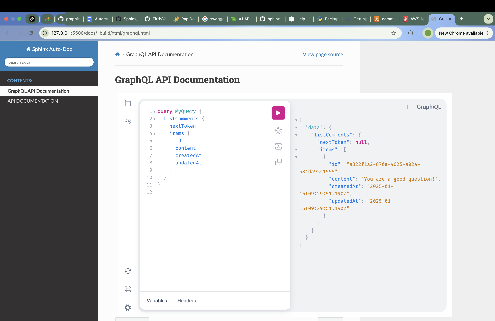
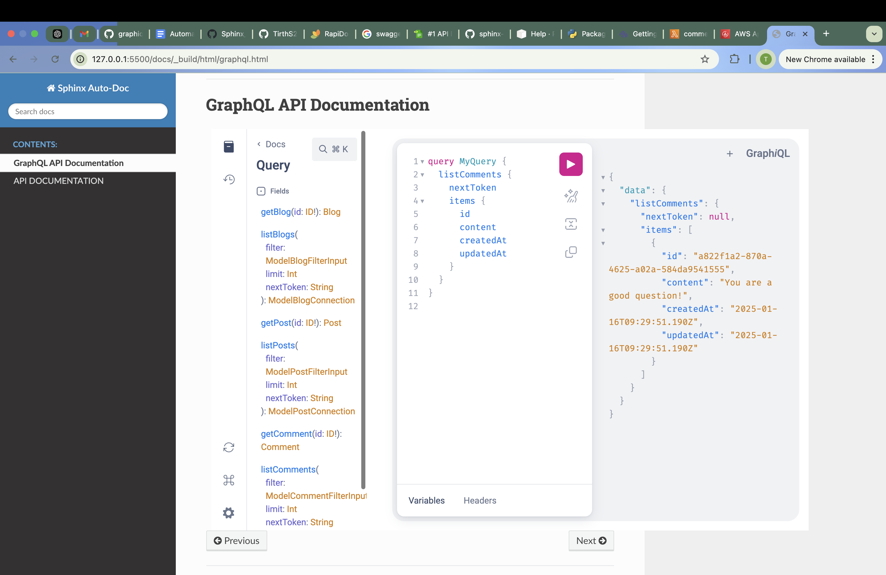

# GraphiQL Integration in Sphinx
GraphiQL powered GraphQL playground renderer for Sphinx.

## Overview
- GraphiQL is the reference implementation of this monorepo, GraphQL IDE, an official project under the GraphQL Foundation. The code uses the permissive MIT license.
- It provides a simple GraphiQL IDE to try (execute) GraphQL APIs on the go.


## Steps to generate GraphiQL IDE in Sphinx:
1. Install the python package in your virtual environment by running following command:
`pip install git+https://github.com/TirthS24/graphiql_sphinx`
1. Include `graphiql_sphinx` in extensions in docs/conf.py file.
2. Create a .rst file with with name `<file_name>` having `graphiql` directive and with following parameters:
    - `endpoint`: GraphQL API Endpoint (Will be hit everytime a query is executed)
    - `query`: Initial Sample Query to be included in the IDE.
    - `response`: Initial Sample Response to be included in the IDE.
    - `headers`: Authorization headers to authenticate endpoint to execute queries.

    Consider the following code example for creating .rst file:
    ```
    GraphQL API DOCUMENTATION
    =========================

    .. graphiql::
        :endpoint: <your_graphql_api_endpoint>
        :headers: {"Content-Type": "application/json", "Authorization": "Bearer <your_JWT_token>" "api-key": <your_api_key>}
    ```

3. Include `<file_name>` in the index.rst file to navigate through REST API documentation.
4. Run the following command in docs directory: `make html`

## Images

*Sample Query*


*IDE with Docs*

## Requirements
Installs following libraries:
- fett
- graphql-core
- sphinx
